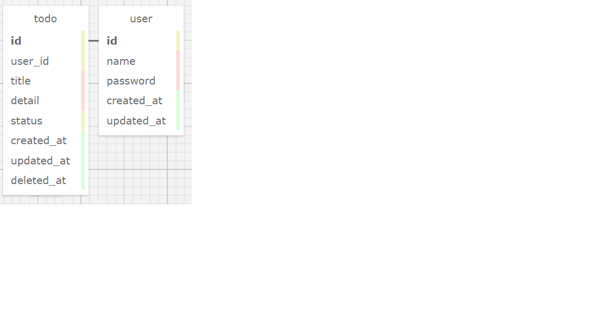

# todolist　概要

機能

* ユーザーログイン　

* ユーザーログアウト　

* ユーザー新規登録　

* ユーザーリスト詳細表示

* todoCRUD：　todo作成　todo削除　todo編集(完了、未完)　todo一覧表示


 
# ページ一覧
 
ログインページ　todolist/view/login/login.php

新規登録ページ　todolist/view/join/index.php　

新規登録確認ページ　todolist/view/join/confirm.php　

todoリスト表示ページ　todolist/view/todo/index.php

todoリスト新規作成ページ　todolist/view/todo/new.php

todoリスト表示　todolist/view/todo/user.php
 
# データベース一覧
 
```bash
CREATE TABLE `todo` (
  `id` int(11) NOT NULL AUTO_INCREMENT,
  `user_id` varchar(45) DEFAULT NULL,
  `title` varchar(45) DEFAULT NULL,
  `detail` varchar(255) DEFAULT NULL,
  `status` tinyint(4) DEFAULT NULL,
  `completed_at` datetime DEFAULT NULL,
  `created_at` datetime DEFAULT NULL,
  `update_at` datetime DEFAULT NULL,
  `deleted_at` datetime DEFAULT NULL,
  PRIMARY KEY (`id`)
```

```bash
CREATE TABLE `user` (
  `id` int(11) NOT NULL AUTO_INCREMENT,
  `name` varchar(45) DEFAULT NULL,
  `password` varchar(45) DEFAULT NULL,
  `created_at` datetime DEFAULT NULL,
  `update_at` datetime DEFAULT NULL,
  PRIMARY KEY (`id`)
  ```
  
